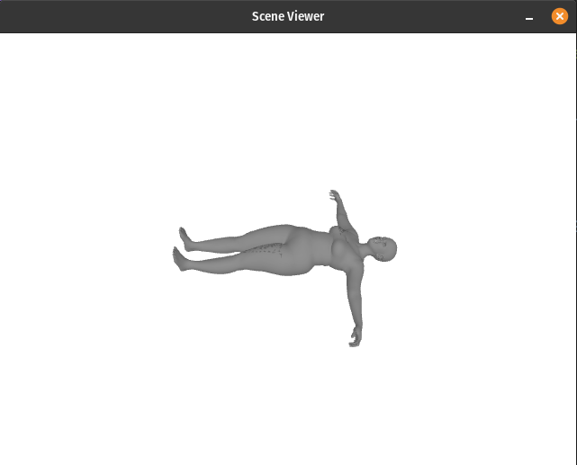
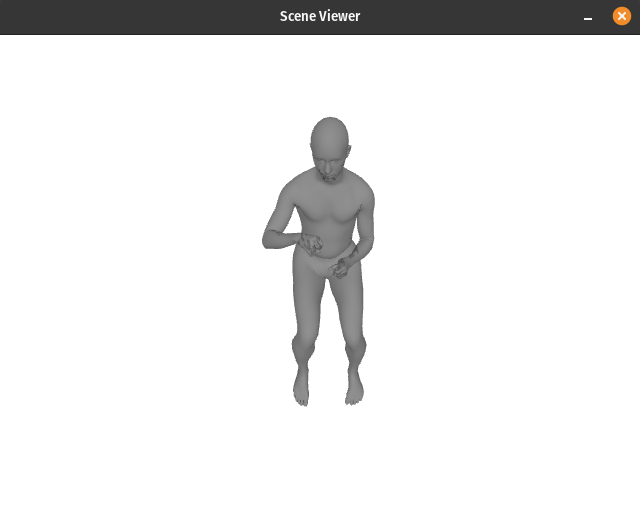
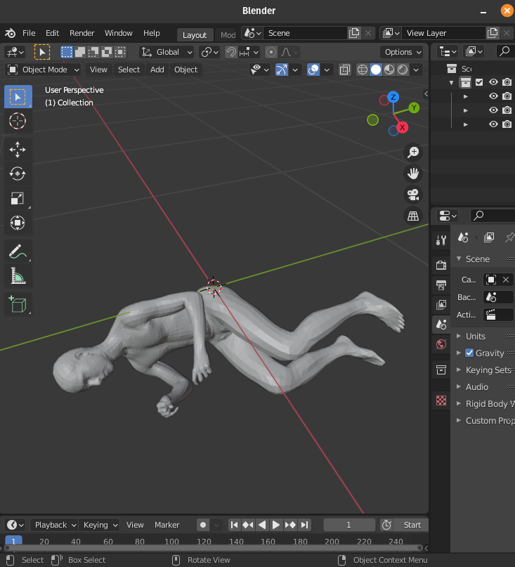
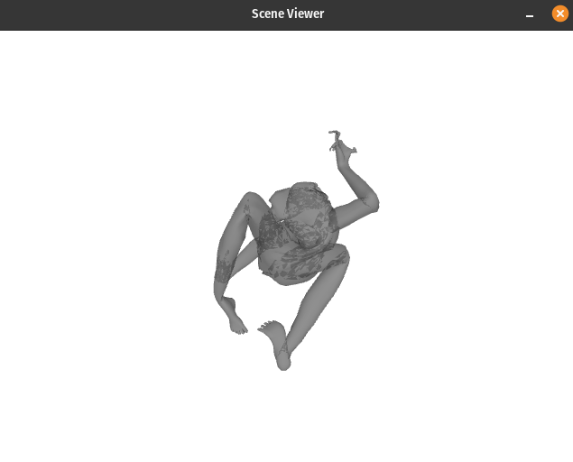
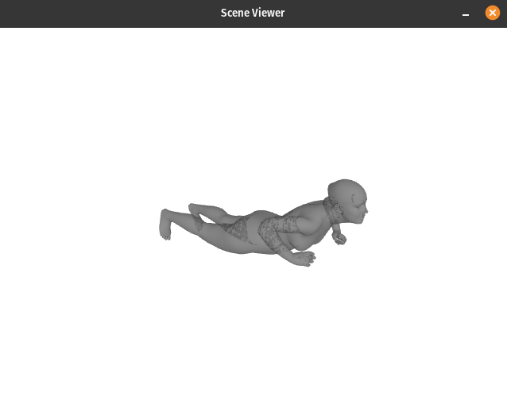

31st January 2022
=================

To test out this conversion utility, I'm trying to convert the sample data
provided with AMASS. It can be found [here](https://github.com/nghorbani/amass/tree/master/support_data/github_data). I'm committing it to this fork of
the `smplx` repo.

First step in converting the sample data is to render it as a mesh and save the
result as a set of `.obj` files.

I think I'm supposed to do this with trimesh based on a single slide in the
SMPL-ify presentation. I took a screenshot of it and added it to
[this issue](https://github.com/vchoutas/smplx/issues/75). If I can get
a trimesh `mesh` object for a given pose, the `.obj` file can be written using
`mesh.export`.

Trying running the `demo.py` script first with `trimesh`.

```
> python demo.py --model-folder ../models
```
renders:


After loading the data I initialize the body model according to what's found in
the `amass_sample.npz`. I get [this
warning](https://github.com/vchoutas/smplx/blob/master/smplx/body_models.py#L143-L146) after initializing the model:

```
WARNING: You are using a SMPL+H model, with only 10 shape coefficients.
```

I can see in the code this is referring to the `num_betas`. But the before
initializing I can see `num_betas=16`.

I edited the error so it prints what it thinks `num_betas` is.

```
WARNING: You are using a SMPL+H model, with only 10 shape coefficients.
num_betas=16, shapedirs.shape=(6890, 3, 16), self.SHAPE_SPACE_DIM=300
```

It seems like the number of betas is always going to be a lot less than 300.

Created a new issue for this [here](https://github.com/vchoutas/smplx/issues/109).

I don't know what else to do but ignore the issue.

It's also throwing away 6 of the shape parameters but there's nothing I can do
about that. Added a note on the issue about this behavior.

It turns out `"poses"` in the `amass_sample.npz` is not the same thing as
`body_poses`. It has to be unpacked into separate arrays for the global
orientation, body and hands. There's an example of how to do this in the AMASS
repository demo notebook
[here](https://github.com/nghorbani/amass/blob/master/notebooks/01-AMASS_Visualization.ipynb).

```
body_parms = {
    'root_orient': torch.Tensor(bdata['poses'][:, :3]).to(comp_device), # controls the global root orientation
    'pose_body': torch.Tensor(bdata['poses'][:, 3:66]).to(comp_device), # controls the body
    'pose_hand': torch.Tensor(bdata['poses'][:, 66:]).to(comp_device), # controls the finger articulation
    'trans': torch.Tensor(bdata['trans']).to(comp_device), # controls the global body position
    'betas': torch.Tensor(np.repeat(bdata['betas'][:num_betas][np.newaxis], repeats=time_length, axis=0)).to(comp_device), # controls the body shape. Body shape is static
    'dmpls': torch.Tensor(bdata['dmpls'][:, :num_dmpls]).to(comp_device) # controls soft tissue dynamics
}
```

However, this doesn't split the left and right hand. The documentation for the
`SMPLH.forward` method is an empty string so I'm going to have to figure out
which parts are the left and right hands myself.

Googling found my way back to an issue
[here](https://github.com/vchoutas/smplx/blob/43561ecabd23cfa70ce7b724cb831b6af0133e6e/smplx/joint_names.py#L166) that lists the names of the joints.

Slicing out the left and right hand poses seems to have failed because I'm
getting the following error:

```
Traceback (most recent call last):
  File "/home/gngdb/repos/smplx/transfer_model/write_obj.py", line 123, in <module>
    main(model_folder, motion_file, model_type, ext=ext,
  File "/home/gngdb/repos/smplx/transfer_model/write_obj.py", line 57, in main
    output = model(
  File "/home/gngdb/repos/fairmotion/.venv/lib/python3.9/site-packages/torch/nn/modules/module.py", line 1102, in _call_impl
    return forward_call(*input, **kwargs)
  File "/home/gngdb/repos/smplx/smplx/body_models.py", line 720, in forward
    left_hand_pose = torch.einsum(
  File "/home/gngdb/repos/fairmotion/.venv/lib/python3.9/site-packages/torch/functional.py", line 325, in einsum
    return einsum(equation, *_operands)
  File "/home/gngdb/repos/fairmotion/.venv/lib/python3.9/site-packages/torch/functional.py", line 327, in einsum
    return _VF.einsum(equation, operands)  # type: ignore[attr-defined]
RuntimeError: einsum(): operands do not broadcast with remapped shapes [original->remapped]: [1, 45]->[1, 1, 45] [6, 45]->[1, 45, 6]
```

Creating a new issue for this problem [here](https://github.com/vchoutas/smplx/issues/110).
I don't know what to do other than fix it by fixing the einsum to sum over the
dimension that matches. It's a little nerve-wracking because it could be that
the body model is loaded wrong and that's what's causing the dimension to be in
the wrong place. Or, the version of the body model file isn't what's expected
and in some other version they've saved that particular tensor transposed.
I have no way of knowing.

Next error it hits is:

```
  File "/home/gngdb/repos/smplx/smplx/body_models.py", line 731, in forward
    full_pose += self.pose_mean
RuntimeError: The size of tensor a (78) must match the size of tensor b (156) at non-singleton dimension 1
```

It seems like the `pose_mean` is the wrong size now? I don't understand how it
can ever match though because `pose_mean` has shape `torch.Size([156])`. It has
no batch dimension!

Now hitting an error during `lbs`, added note to issue.

Shapes of `betas` and `full_pose` before going into `lbs` are: `torch.Size([16])
torch.Size([1, 156])` respectively. Problem could be due to the batch dimension.
When they sample `betas` they expect a batch dimension in the `demo.py` script.

Slicing `betas` to reduce it to whatever the model expects. Added another note
to the issue.

Then I was able to render the first pose in the amass sample pose sequence.



I was able to save this using `tri_mesh.export` and then load the `.obj` file
into blender:



To create a folder full of `.obj` files I only need to iterate over the frames
in the `amass_sample.npz` file.

Created 601 `.obj` files for the amass sample data in 23 seconds, folder size is
407MB.

Now trying to convert this to SMPL-X using the provided tool.

Copying the `smplh2smplx.yaml` file and editing to process this output folder.

By default, it looks like it's going to try and find the body models in
`transfer_data/body_models` but the install instructions told me to put them in
the root of the repo in `models` so it will likely hit an error when it fails to
find them.

Trying to run it, immediately hit an error saying a module called `loguru` is
not installed. It appears to be another [third party logging
module](https://pypi.org/project/loguru/) that's not
used in the main repo.

Installing it to my venv.

Running `transfer_model` with the prescribed command fails in the
`transfer_model` subdir. I think it has to be run from root.

Next error is it can't find `open3d`. Installing that to the venv with `pip`.

Next error is it can't find `omegaconf`. Installing that to the venv with `pip`.

Next error is it can't find `psbody`. It seems to be part of [mesh](https://github.com/MPI-IS/mesh)
so I should be able to install that repo via pip with: `pip install git+https://github.com/MPI-IS/mesh.git`

That install failed with a compilation error.

Looking at the install instructions from their repo I need to install
`libboost-dev` first.

Installed `libboost-dev` and tried to install again, got the same compile
error.

Tried running `make all`. It tried to download and install new versions of
`numpy`, `scipy`, `matplotlib` etc. Then it hit another compile error.

One issue in the `mesh` repo suggests that maybe Python 3.6 will work. Currently
I've been using Python 3.9.7.

Creating a new conda env with Python 3.6 to see if that helps.

Running `make all` in the new conda env. I think it installed, however it prints
a series of warnings about the Python version being 3.6:

```
Successfully installed psbody-mesh-0.4
  Link requires a different Python (3.6.13 not in: '>=3.7'): https://files.pythonhosted.org/packages/9f/8b/a094f5da22d7abf5098205367b3296dd15b914f4232af5ca39ba6214d08c/pip-22.0-py3-none-any.whl#sha256=6cb1ea2bd7fda0668e26ae8c3e45188f301a7ef17ff22efe1f70f3643e56a822 (from https://pypi.org/simple/pip/) (requires-python:>=3.7)
  Link requires a different Python (3.6.13 not in: '>=3.7'): https://files.pythonhosted.org/packages/4a/ca/e72b3b399d7a8cb34311aa8f52924108591c013b09f0268820afb4cd96fb/pip-22.0.tar.gz#sha256=d3fa5c3e42b33de52bddce89de40268c9a263cd6ef7c94c40774808dafb32c82 (from https://pypi.org/simple/pip/) (requires-python:>=3.7)
  Link requires a different Python (3.6.13 not in: '>=3.7'): https://files.pythonhosted.org/packages/89/a1/2f4e58eda11e591fbfa518233378835679fc5ab766b690b3df85215014d5/pip-22.0.1-py3-none-any.whl#sha256=30739ac5fb973cfa4399b0afff0523d4fe6bed2f7a5229333f64d9c2ce0d1933 (from https://pypi.org/simple/pip/) (requires-python:>=3.7)
  Link requires a different Python (3.6.13 not in: '>=3.7'): https://files.pythonhosted.org/packages/63/71/5686e51f06fa59da55f7e81c3101844e57434a30f4a0d7456674d1459841/pip-22.0.1.tar.gz#sha256=7fd7a92f2fb1d2ac2ae8c72fb10b1e640560a0361ed4427453509e2bcc18605b (from https://pypi.org/simple/pip/) (requires-python:>=3.7)
  Link requires a different Python (3.6.13 not in: '>=3.7'): https://files.pythonhosted.org/packages/83/b5/df8640236faa5a3cb80bfafd68e9fb4b22578208b8398c032ccff803f9e0/pip-22.0.2-py3-none-any.whl#sha256=682eabc4716bfce606aca8dab488e9c7b58b0737e9001004eb858cdafcd8dbdd (from https://pypi.org/simple/pip/) (requires-python:>=3.7)
  Link requires a different Python (3.6.13 not in: '>=3.7'): https://files.pythonhosted.org/packages/d9/c1/146b24a7648fdf3f8b4dc6521ab0b26ac151ef903bac0b63a4e1450cb4d1/pip-22.0.2.tar.gz#sha256=27b4b70c34ec35f77947f777070d8331adbb1e444842e98e7150c288dc0caea4 (from https://pypi.org/simple/pip/) (requires-python:>=3.7)
```

Maybe it would have worked with Python 3.8?

Created a new conda environment with Python 3.8 and ran `make all` again. This
time I didn't get the warnings.

Installing `smplx` and dependencies to this new environment.

Installing the `torch_trust_ncg` package now fails because the authors have
updated it since January 22nd. I rolled back to version
`91ef87fd83085fc99415687089dee88d087dc16f`.

Finally managed to get it to run without an import error. Unfortunately, hit
a cuda error:

```
> python -m transfer_model --exp-cfg config_files/smplh2smplx_as.yaml
INFO - 2022-01-31 17:30:50,979 - acceleratesupport - No OpenGL_accelerate module
loaded: No module named 'OpenGL_accelerate'
2022-01-31 17:30:51.170 | ERROR    | __main__:main:41 - CUDA is not available!
```

Unfortunately, it has not provided a Python stack trace so I can't figure out
where that might be happening so I can ask it not to use the GPU.

Found the hardcoded device setting in `__main__.py`. Changed it to `cpu` to see
if that would work.

Next error:

```
Traceback (most recent call last):
  File "/home/gngdb/miniconda3/envs/mesh_p38/lib/python3.8/runpy.py", line 194, in _run_module_as_main
    return _run_code(code, main_globals, None,
  File "/home/gngdb/miniconda3/envs/mesh_p38/lib/python3.8/runpy.py", line 87, in _run_code
    exec(code, run_globals)
  File "/home/gngdb/repos/smplx/transfer_model/__main__.py", line 100, in <module>
    main()
  File "/home/gngdb/repos/smplx/transfer_model/__main__.py", line 54, in main
    body_model = build_layer(model_path, **exp_cfg.body_model)
  File "/home/gngdb/repos/smplx/smplx/body_models.py", line 2352, in build_layer
    raise ValueError(f'Unknown model type {model_type}, exiting!')
ValueError: Unknown model type body, exiting!
```

This might be something to do with the body model directory being set wrong.

Fixing that.

It's running! Estimated time to completion 2.5 hours.

Left it running and stopped working for the day.

1st February 2022
=================

Completed in 2:49:58.

Not sure where it writes output to. Looks like it's written to `output`, which
must be the default output directory because I didn't specify one.

There were 601 `.obj` files in the input directory. It looks like each one has
been written to two output files: one `.obj` and one `.pkl`. Opening up a `.pkl`
file to see what's in there:

```
transl <class 'torch.Tensor'> torch.Size([1, 3])
global_orient <class 'torch.Tensor'> torch.Size([1, 1, 3, 3])
body_pose <class 'torch.Tensor'> torch.Size([1, 21, 3, 3])
betas <class 'torch.Tensor'> torch.Size([1, 10])
left_hand_pose <class 'torch.Tensor'> torch.Size([1, 15, 3, 3])
right_hand_pose <class 'torch.Tensor'> torch.Size([1, 15, 3, 3])
jaw_pose <class 'torch.Tensor'> torch.Size([1, 1, 3, 3])
leye_pose <class 'torch.Tensor'> torch.Size([1, 1, 3])
reye_pose <class 'torch.Tensor'> torch.Size([1, 1, 3])
expression <class 'torch.Tensor'> torch.Size([1, 10])
vertices <class 'torch.Tensor'> torch.Size([1, 10475, 3])
joints <class 'torch.Tensor'> torch.Size([1, 144, 3])
full_pose <class 'torch.Tensor'> torch.Size([1, 55, 3, 3])
v_shaped None
faces [[    3     1     0]
 [    7     5     4]
 [   12    14    13]
 ...
 [ 9944 10097 10084]
 [ 9940 10084 10071]
 [10071 10058  9932]]
```

So I guess the next step would be to merge these `.pkl` files together.

I guess I don't want to keep all of these things, AMASS files typically 
don't contain the vertices, for example. And they're recoverable using the other
parameters anyway. I'll merge everything that can be passed to a SMPL-X body
model module, which is:

```
betas: Optional[Tensor] = None,
global_orient: Optional[Tensor] = None,
body_pose: Optional[Tensor] = None,
left_hand_pose: Optional[Tensor] = None,
right_hand_pose: Optional[Tensor] = None,
transl: Optional[Tensor] = None,
expression: Optional[Tensor] = None,
jaw_pose: Optional[Tensor] = None,
leye_pose: Optional[Tensor] = None,
reye_pose: Optional[Tensor] = None,
return_verts: bool = True,
return_full_pose: bool = False,
pose2rot: bool = True,
return_shaped: bool = True,
```

And finally, visualize this SMPL-X pose and verify it looks the same as the
original pose.

Wrote a script to merge all the output files but I've noticed a problem: it fits
a separate `betas` to every one of the `.obj` files. I suppose if the
optimization were reliable the betas output would be quite similar. I got the
following results for betas over this sample file:

```
-15.346 +/- 0.736
2.167 +/- 1.081
-2.566 +/- 1.689
-6.050 +/- 1.797
-8.600 +/- 2.713
1.414 +/- 2.619
-2.195 +/- 2.738
1.170 +/- 2.910
-0.154 +/- 2.633
-11.169 +/- 5.117
```

Which seems like quite a large range. Creating an issue for this
[here](https://github.com/vchoutas/smplx/issues/112).

Successfully saved merged file, final size is 3.3MB. I've realized that the
gender gets lost in the conversion so will have to be written into this new pkl
file.

I've just realized that the joint angles in these output pickle files all have
trailing dimensions (3,3) suggesting that they're output as rotation matrices.
I don't know if that's the case because the documentation doesn't specify but
I'll have to assume so. In that case, I should convert them to axis-angle 
before saving. Using
[scipy.spatial.transform.Rotation](https://docs.scipy.org/doc/scipy/reference/generated/scipy.spatial.transform.Rotation.html).

Visualizing the SMPL-X it appears the conversion has failed:



Trying a random SMPL-X AMASS file to check my script for visualizing SMPL-X
files is OK.

```
mv ACCAD/Female1General_c3d/A10_-_lie_to_crouch_stageii.npz ~/repos/smplx/transfer_data/sample_amass_smplx.npz
```

Viewing that seems to work:



2nd February 2022
=================

When running the fitting procedure to convert between models I did notice that
the loss would not go to zero. Maybe the suggests that the optimization
procedure is having some issues? So, I'm going to look more closely at that.

Copying one `.obj` file into a separate directory to convert it on it's own.

Creating experiment config pointing at this directory called
`smplh2smplx_onepose.yaml`.

Full log running that is [here](./notes/onepose.log)

Looking at the log I'm seeing warnings about the gradient being evaluated using
`create_graph=True` in a way that can cause a memory leak. Also the final loss
is 1191.08.

What if I run the fit for much longer?

After 1000 iterations the final loss is still 1189.14. Viewing the output `.obj`
and it is still mangled.

Trying the l-BFGS optimizer because it's PyTorch built-in.

I don't get any gradient warnings with l-BFGS, which is nice.

Loss stops improving at 5945.79.

Trying Adam, final loss is 1462.28 after 1000 iterations.

It does still seem to be improving, running for 10,000 iterations.

There appear to be two fitting steps, the first very little improves, and on the
second things start to improve.

After 10,000 iterations of Adam it finished at 1197.79. Optimized `.obj` file is
still mangled.

Seems like the optimization is configured wrong or intialized wrong or the
optimizers are all broken.
